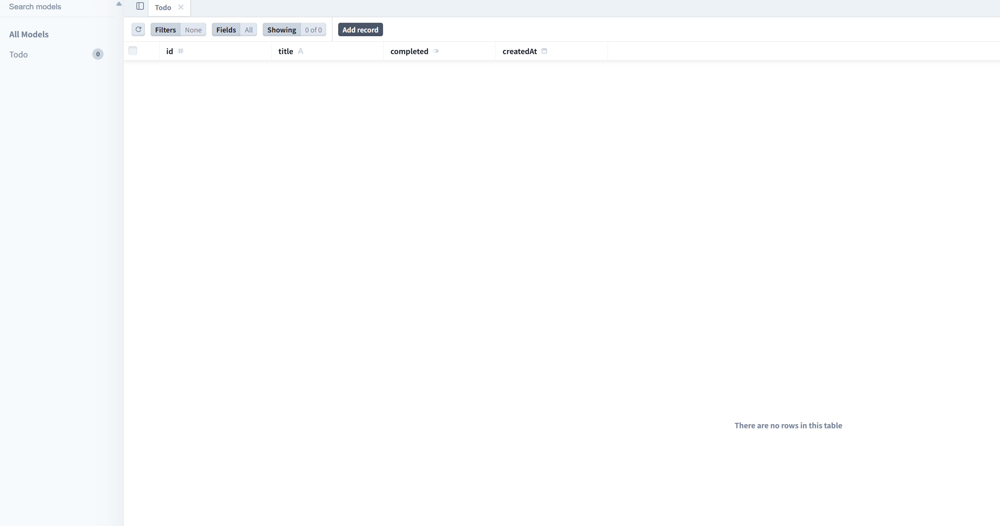

# Monorepo TRPC Scaffold

## 注：打包有点问题

这是一个基于 Monorepo 的全栈项目脚手架，使用了 tRPC、Hono、React、TypeScript 和 Vite 等技术栈。项目通过 `pnpm` 工作区进行管理。

## 项目结构

项目采用 Monorepo 结构，包含多个子应用和共享包：

### 📁 `apps/api`

- **框架**: 使用 Hono 构建后端服务。
- **tRPC 集成**: 使用 tRPC 定义类型安全的 API 路由。
- **数据库**: 使用 Prisma 进行数据库建模和迁移。
- **路由**: 通过 Hono 的 tRPC 中间件处理 `/trpc` 路由。
- **开发服务器**: 使用 `tsx` 提供开发时的热重载。

### 📁 `apps/web`

- **框架**: 使用 React 构建前端应用。
- **类型安全查询**: 集成 `@trpc/react-query` 实现类型安全的 API 调用。
- **构建工具**: 使用 Vite 提供快速构建和开发服务器。
- **TypeScript 支持**: 完整支持 TypeScript，使用 SWC 进行快速编译。
- **UI 框架**: 不依赖 UI 框架，仅使用原生 React 组件。

### 📁 `packages/shared`

- **共享代码**: 包含共享的类型定义、工具函数和 tRPC 路由定义，供前后端使用。
- **TypeScript 路径别名**: 使用路径别名（`@monorepo-trpc-scaffold/shared/*`）简化导入。

---

## 技术栈

| 层级              | 技术              | 描述                                                                  |
| ----------------- | ----------------- | --------------------------------------------------------------------- |
| **语言**          | TypeScript        | 类型安全的 JavaScript 超集。                                          |
| **Monorepo 工具** | pnpm              | 快速、高效的包管理工具，支持工作区。                                  |
| **后端框架**      | Hono              | 轻量级、快速的 Web 框架，支持 Deno、Bun 和 Node.js。                  |
| **tRPC 集成**     | tRPC              | 零运行时开销的端到端类型安全 API。                                    |
| **ORM**           | Prisma            | 下一代 Node.js 和 TypeScript ORM，支持 PostgreSQL、MySQL、SQLite 等。 |
| **前端框架**      | React             | 声明式 UI 库。                                                        |
| **状态管理**      | React Query       | 强大的数据获取和缓存库。                                              |
| **构建工具**      | Vite              | 极速构建工具，原生支持 TypeScript。                                   |
| **代码质量**      | ESLint + Prettier | 提供一致的代码检查和格式化工具。                                      |

---

## 快速开始

### 环境要求

- 安装 [Node.js](https://nodejs.org/) (建议使用 v16 或更高版本)。
- 全局安装 `pnpm`:
  ```sh
  npm install -g pnpm
  ```

### 安装依赖

1. 克隆项目代码：

   ```sh
   git clone <仓库地址>
   cd monorepo-trpc-scaffold
   ```

2. 安装依赖：
   ```sh
   pnpm install
   ```

### 启动项目

#### 启动后端服务

1. 在apps/api目录下创建.env文件并且加上以下内容`DATABASE_URL=file:./dev.db`，如果需要连接远程数据库，请修改为相应的数据库连接字符串。

2. 生成 Prisma 客户端：`pnpm db:generate`

3. 推送数据库模式到数据库：`pnpm db:push`

4. 运行`pnpm db:studio `查看数据库表是否生成



运行以下命令启动 API 服务：

```sh
pnpm dev:api
```

服务默认运行在 [http://localhost:3000](http://localhost:3000)。

#### 启动前端服务

运行以下命令启动 Web 应用：

```sh
pnpm dev:web
```

应用默认运行在 [http://localhost:5173](http://localhost:5173)。

---

## 数据库管理

项目使用 Prisma 进行数据库管理，数据库模式定义在 `apps/api/prisma/schema.prisma` 文件中。

### 常用命令

- 生成 Prisma 客户端：

  ```sh
  pnpm db:generate
  ```

- 推送数据库模式到数据库：

  ```sh
  pnpm db:push
  ```

- 打开 Prisma Studio：

  ```sh
  pnpm db:studio
  ```

- 运行数据库迁移：
  ```sh
  pnpm db:migrate
  ```

---

## 代码质量

- 运行 ESLint 检查代码：

  ```sh
  pnpm lint
  ```

- 使用 Prettier 格式化代码：

  ```sh
  pnpm format
  ```

- 检查代码格式：
  ```sh
  pnpm format:check
  ```

---

## 贡献

欢迎提交 Issue 或 Pull Request 来改进此脚手架。

---

## 许可证

本项目基于 ISC 许可证开源。
